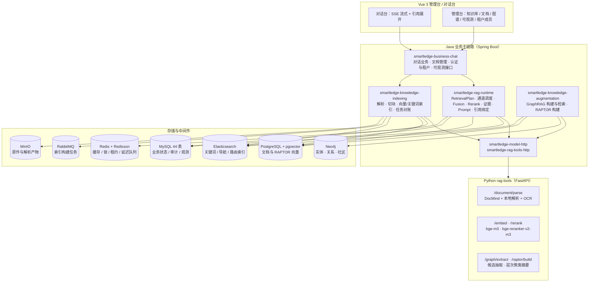

# Smartledge

**多租户企业知识库 RAG 问答平台** —— 五路检索与可核验证据、不靠模型猜测的显式引用、从文档解析到回答归档的完整闭环。

Java 业务主链路（Spring Boot） × Python 算法工具箱（FastAPI） × Vue 管理台


## English Overview

Smartledge is a multi-tenant enterprise knowledge-base RAG platform. A Spring Boot service owns the whole business chain — document and task state, knowledge scope, retrieval planning, channel dispatch, fusion/rerank orchestration, evidence selection, prompt assembly, citation binding and conversation archiving. A Python FastAPI toolbox owns model-side capabilities (document parsing, embedding, reranking, GraphRAG candidate extraction, RAPTOR tree building) and decides nothing about scope, routing or final evidence. The verdict on what counts as *source evidence* is made in exactly one place, and citations are bound by parsing explicit `[n]` tokens in the answer — never inferred, repaired or supplemented by a model.

## 它解决什么问题

企业知识问答的难点通常不在"接一个大模型"，而在下面四件事同时成立：

1. **知识范围必须可信**：谁能问哪些文档（租户、角色、文档级 ACL）必须在检索前就被确定，而不是检索后再过滤。
2. **证据必须可核验**：回答里每一个 `[n]` 都要能回到同一次请求里真实渲染给模型的候选片段，不能由模型自由发挥。
3. **多路召回必须可解释**：关键词、向量、表格、图谱、层次树各有擅长的问法，融合与重排的每个分数都要能说清来源。
4. **链路必须可观测**：一次问答经过哪些阶段、走了哪些通道、每个通道召回什么、最终为什么选中这几条证据，都要能回放。

Smartledge 把上述四点做成了代码里的**显式不变量**，而不是提示词里的期望：检索计划只解释一次、Source Evidence 与 Context Only 物理分池、最终证据选择只有一个权威、引用绑定只解析答案里的合法 1-based ASCII `[n]` token。

## 架构



## 核心能力

| 能力 | 实现位置 | 说明 |
| --- | --- | --- |
| 单次解释的检索计划 | [`RetrievalPlan`](smartledge-business/smartledge-rag-runtime/src/main/java/org/smartledge/ai/chatagent/rag/model/RetrievalPlan.java) | 知识范围、查询、过滤、通道、预算、排序特征在通道执行前一次性组装；Provider 只消费并投影计划，不重新解释范围与路由 |
| 五路检索通道 | [`rag/retrieve/channel/`](smartledge-business/smartledge-rag-runtime/src/main/java/org/smartledge/ai/chatagent/rag/retrieve/channel/) | 关键词（ES）、向量（pgvector）、表格、GraphRAG、RAPTOR 各自独立通道，可并行编排、可单独观测 |
| 融合与重排 | [`HybridFusionService`](smartledge-business/smartledge-rag-runtime/src/main/java/org/smartledge/ai/chatagent/rag/service/HybridFusionService.java) · [`RagRerankService`](smartledge-business/smartledge-rag-runtime/src/main/java/org/smartledge/ai/chatagent/rag/service/RagRerankService.java) | 通道加权与 RRF 两套融合策略 + 通道内归一化 + 元数据加权；重排走本地 `bge-reranker-v2-m3` cross-encoder |
| 证据选择唯一权威 | [`FinalEvidenceSelectionPolicy`](smartledge-business/smartledge-rag-runtime/src/main/java/org/smartledge/ai/chatagent/rag/service/FinalEvidenceSelectionPolicy.java) | 只有它能把候选提升为 Source Evidence；Context Expansion 只产出 Context Only，两类池物理隔离 |
| 显式引用绑定 | [`ExplicitCitationBindingService`](smartledge-business/smartledge-rag-runtime/src/main/java/org/smartledge/ai/chatagent/rag/service/ExplicitCitationBindingService.java) | 只解析答案中的合法 1-based ASCII `[n]`，且只能绑定同轮 Prompt manifest 中真实渲染或复用的 Source；不用相似度或模型猜测补全引用 |
| GraphRAG | [`GraphRagBuildServiceImpl`](smartledge-business/smartledge-knowledge-augmentation/src/main/java/org/smartledge/ai/knowledge/augmentation/service/impl/GraphRagBuildServiceImpl.java) · [`GraphRagSearchServiceImpl`](smartledge-business/smartledge-knowledge-augmentation/src/main/java/org/smartledge/ai/knowledge/augmentation/service/impl/GraphRagSearchServiceImpl.java) | 实体/关系抽取、实体消解与规范化、社区与跨文档社区；图谱候选在检索期作为独立通道参与召回 |
| RAPTOR | [`RaptorBuildServiceImpl`](smartledge-business/smartledge-knowledge-augmentation/src/main/java/org/smartledge/ai/knowledge/augmentation/service/impl/RaptorBuildServiceImpl.java) · [`RaptorSearchServiceImpl`](smartledge-business/smartledge-knowledge-augmentation/src/main/java/org/smartledge/ai/knowledge/augmentation/service/impl/RaptorSearchServiceImpl.java) | 层次聚类构建摘要树、检索期按层召回，兼顾"整篇主题"与"局部细节"两类问法 |
| 多租户与权限 | [`SmartledgeTenantLineHandler`](smartledge-common/smartledge-common-web/src/main/java/org/smartledge/database/tenant/) · `auth/` 包 | MyBatis-Plus 租户行级重写 + `TenantContext` 跨四类异步边界显式传播 + RBAC（ADMIN/CURATOR/USER）+ 文档级 ACL + 向量表租户隔离 |
| 文档解析与索引编排 | [`smartledge-knowledge-indexing`](smartledge-business/smartledge-knowledge-indexing/) | 解析产物归档、结构化切块、向量与关键词索引、任务投递与对账（RabbitMQ + 定时对账），失败可重试 |
| 可观测性 | 观测表 `chat_retrieval_result` / `chat_channel_execution` / `chat_stage_benchmark` + [`ObservabilityManageController`](smartledge-business/smartledge-business-chat/src/main/java/org/smartledge/ai/manage/controller/ObservabilityManageController.java) | 会话 → 请求 → 阶段三级下钻；通道级召回明细、阶段耗时、证据与引用快照可回放 |
| SSE 流式对话 | [`BusinessChatController`](smartledge-business/smartledge-business-chat/src/main/java/org/smartledge/ai/chatagent/controller/BusinessChatController.java) · [`api.js`](vue/src/api/api.js) | 后端 `text/event-stream`；前端增量解析并对乱序/重复事件做幂等合并（`shouldApplyStreamEvent` / `mergeAssistantStreamEvent`） |
| 评测与探针 | [`evaluation/`](smartledge-business/smartledge-rag-runtime/src/main/java/org/smartledge/ai/chatagent/evaluation/) | 手续快照（CONTRACT / TRACE / BINDING，不是 relevance）· `rag-gold.v1` 计分器 · `rag-gold-replay.v1` · 只读检索探针；离线 faithfulness 在 `rag_tools.eval` |

## 技术栈

| 层 | 选型 |
| --- | --- |
| 后端 | Java 17 · Spring Boot 3.5.6 · MyBatis-Plus 3.5.7 · Redisson 3.32 · Knife4j 4.3 · Hutool · Reactor |
| 检索与存储 | MySQL（44 张业务表）· PostgreSQL + pgvector（1024 维）· Elasticsearch 8.18 + IK · Neo4j 5.26 · Redis 7.4 · RabbitMQ 4.3 · MinIO |
| 模型侧 | 对话 `qwen3.7-plus` · 向量 `qwen3.7-text-embedding`(1024d) · 重排 `qwen3.7-text-rerank`（OpenAI 兼容网关 / 阿里云百炼）· 文档解析阿里云 DocMind + 本地兜底 · Tavily 联网检索 |
| Python 工具箱 | Python 3.11 · FastAPI 0.115 · sentence-transformers · PyMuPDF · networkx |
| 前端 | Vue 3.4 · Vite 6.1 · Tailwind CSS 4.3 · shadcn-vue / reka-ui · Cytoscape（图谱可视化）· marked + DOMPurify |
| 测试 | JUnit 5 · pytest · Vitest 3.2 · Playwright 1.61（含 axe 无障碍断言） |

## 快速开始

### 前置条件

- JDK 17+、Maven 3.9+、Node.js 20+、Docker 与 Docker Compose
- Python 3.11 与 [`uv`](https://github.com/astral-sh/uv)（用于 rag-tools 虚拟环境）
- 一个阿里云百炼 API Key（对话与向量化共用）；可选 Tavily Key（联网检索）

### 1. 配置凭据

```bash
cp .env.example .env
# 编辑 .env，至少填入 ALI_BAI_LIAN_API_KEY
```

`.env` 有三个消费点：Java 通过 `spring.config.import` 读取（**必须从仓库根目录启动**）、Python 通过启动脚本注入、Compose 通过 `--env-file` 读取。使用百炼专属网关或自建兼容服务时，用 `SMARTLEDGE_CHAT_BASE_URL` 与 `RAG_TOOLS_LLM_BASE_URL` 覆盖默认端点（两者必须指向同一网关）。

### 2. 启动依赖栈

```bash
docker compose --env-file .env -f deploy/docker-compose.yml up -d
docker compose -f deploy/docker-compose.yml ps
```

首次启动会自动执行 MySQL 建库建表与 Postgres 建表脚本（见 `deploy/docker-compose.yml` 的挂载项）。7 个服务的本机端口：MySQL **3307**、PostgreSQL **5432**、Redis **6381**、RabbitMQ **5672 / 15672**、Neo4j **7687 / 7474**、MinIO **9000 / 9001**、Elasticsearch **9201**。

### 3. 启动 Python 算法服务（解析 + 云端重排适配）

向量化与重排默认走云端 API，**服务器不需要部署本地模型**（省掉约 5GB 依赖与 4-6GB 常驻内存）：

```bash
cd smartledge-rag-tools
uv venv --python 3.11 .venv
uv pip install --python .venv/bin/python -r requirements-cloud.txt   # 云端模式：不含 torch
cd ..
deploy/start-rag-tools.sh --daemon
deploy/start-rag-tools.sh --status
```

若要在本地推理向量化与重排（离线环境或大内存机器），改用 `requirements.txt`，并把 `.env` 里的
`SMARTLEDGE_EMBEDDING_PROVIDER` 设为 `rag-tools`、`RAG_TOOLS_RERANK_PROVIDER` 设为 `local`。

### 4. 构建并启动后端

```bash
mvn -DskipTests package
nohup java -jar smartledge-business/smartledge-business-chat/target/smartledge-business-chat-0.0.1-SNAPSHOT.jar \
  > /tmp/smartledge-app.log 2>&1 &
```

### 5. 启动前端

```bash
cd vue
npm install
npm run dev     # http://127.0.0.1:5174，已代理 /api、/admin/auth、/manage 到后端 9083
```

### 演示账号（来自 `sql/表数据` 种子）

| 用户名 | 口令 | 租户 | 角色 |
| --- | --- | --- | --- |
| `admin` | `admin123456` | 1 | ADMIN：全部权限 |
| `curator` | `curator123456` | 1 | CURATOR：无用户与租户管理 |
| `alice` | `user123456` | 1 | USER：仅对话与文档查看 |
| `bob` | `user123456` | 2 | USER：另一租户，用于验证隔离 |

## 目录结构

```text
.
├── pom.xml                                 # Maven 聚合（groupId org.smartledge）
├── smartledge-business/                    # 业务服务
│   ├── smartledge-business-chat/           #   唯一启动模块：对话业务、文档管理、认证、可观测接口
│   ├── smartledge-rag-runtime/             #   检索计划、通道、融合、重排、证据、Prompt、引用绑定
│   ├── smartledge-knowledge-indexing/      #   解析、切块、索引编排、任务对账
│   ├── smartledge-knowledge-augmentation/  #   GraphRAG 与 RAPTOR 构建/检索
│   ├── smartledge-model-http/              #   模型 HTTP 协议客户端
│   └── smartledge-rag-tools-http/          #   Python 算法服务协议客户端
├── smartledge-common/                      # 公共基座（Web / Jackson / MyBatis-Plus / 租户 / 枚举）
├── smartledge-id-generator-framework/      # 雪花 ID（适配自开源 uid 生成器，保留 com.baidu.fsg.uid 包结构）
├── smartledge-redisson-framework/          # 分布式锁 / 租约 / 幂等 / 延迟队列 AOP 封装
├── smartledge-redis-tool-framework/        # Redis 缓存工具
├── smartledge-rag-tools/                   # Python 算法工具箱（FastAPI）
│   ├── rag_tools/                          #   main.py · document_parser · semantic_model · graph_extract · raptor_build
│   ├── prompt/                             #   GraphRAG / RAPTOR 的 Prompt 模板
│   └── tests/                              #   pytest（59 个用例）
├── vue/                                    # Vue 3 管理台与对话台
├── deploy/                                 # docker-compose 依赖栈 + rag-tools 启停脚本
├── sql/                                    # 建库建表、增量迁移与种子数据
└── 文档例子演示/                            # 演示语料：PDF（含扫描 OCR 样例）、中文制度文档、跨文档图谱样本
```

## 关键设计不变量

这几条是代码里的硬约束，也是这个项目最值得看的部分：

1. **检索计划只解释一次。** `RetrievalPlan` 在通道执行前完成对知识范围、查询、过滤、通道、预算与排序特征的唯一解释；所有 Provider 只消费该计划并做协议投影，不得重新解释知识范围或路由结果。
2. **Source Evidence 与 Context Only 物理分池。** 上下文扩展只能产出 Context Only；没有稳定 identity、越界 token、未渲染的候选一律 fail closed，不允许"看起来相关"就进最终证据。
3. **最终证据只有一个权威。** `FinalEvidenceSelectionPolicy` 是唯一能把候选提升为 Source Evidence 的地方；fusion 只负责合并与算特征，rerank 只负责排序统一窗口。
4. **引用绑定不做推断。** 显式引用绑定只解析答案中的合法 1-based ASCII `[n]` token，并且只能绑定同轮 Prompt manifest 中真实渲染（`PROMPT_RENDERED_SOURCE`）或复用（`PROMPT_REUSED_SOURCE`）的 Source；最终引用组必须是合格身份集合按首次出现顺序形成的有序子集。答案里没有合法 token 时引用数组必须为空 —— 不用相似度、NLI、词法规则或生成模型去猜测、修复、补充引用。
5. **一个业务决定只有一个权威。** 租户过滤、知识范围、路由、通道、窗口、最终证据、citation 各自的权威实现只有一处；投影层可以转换协议与存储形状，但不能重新解释这些决定。

## 高可用与降级

外部模型是这套系统的强依赖，链路按"**瞬时故障重试、不可恢复失败显式降级、绝不伪造结果**"来设计：

| 环节 | 机制 | 位置与配置 |
| --- | --- | --- |
| 对话 / 向量化（Java 直连云端） | 有界重试（默认 3 次，线性退避）+ 请求截止时间 + 响应体上限；只重试可恢复失败（超时、连接错误、429、5xx） | `ModelHttpClient#request`；`app.ai.retry.chat-max-attempts` / `embedding-max-attempts` |
| 重排（Python 适配云端） | 进程内并发闸门（默认 4，防自造 429）+ 指数退避 + 随机抖动（默认 3 次） | `rag_tools/semantic_model.py`；`RAG_TOOLS_RERANK_MAX_CONCURRENCY` / `_MAX_ATTEMPTS` / `_BACKOFF_SECONDS` |
| 重排整体失败 | **降级为融合序继续回答**，同时在证据 ledger 记 `RerankResultStatus.UNUSABLE` 与失败阶段；不伪造分数 | `RagRerankService` + `RagRetrievalEngine` |
| 入口限流 | nginx 按 IP：对话 20 次/分钟、其他接口 300 次/分钟，公开演示不会被单 IP 刷爆 | `deploy/server/nginx-smartledge.conf` |
| 任务级容错 | 索引任务失败可重投；RabbitMQ 发布方确认 + 定时对账纠正漏投 | `smartledge-knowledge-indexing` |
| 健康检查 | `/actuator/health`（应用 + 数据库）、rag-tools `/health`（provider、重试与并发参数） | systemd 两个服务 + compose healthcheck |

刻意**不做**的两件事：不缓存或复用旧向量、旧分数来掩盖失败；不用生成模型补答案之外的事实。这两种"降级"会让证据不可核验，违反引用不变量。

## 测试与质量门禁

| 层 | 规模 | 命令 |
| --- | --- | --- |
| Java | 32 个测试类（认证、租户传播、ACL、消息拓扑、pgvector 租户操作、架构守护等） | `mvn test` |
| Python | 59 个测试用例（Markdown 解析、图谱候选隔离、RAPTOR 并发、跨语言 HTTP 探针等） | `cd smartledge-rag-tools && .venv/bin/python -m pytest` |
| 前端单测 | 34 个 Vitest spec | `cd vue && npm run test:unit` |
| 前端 E2E | 4 个 Playwright 用例（含 axe 无障碍断言） | `cd vue && npm run test:e2e` |
| 前端静态门禁 | 设计令牌与语义色检查 | `cd vue && npm run check:f03` |
| 编译门禁 | 全模块编译（含测试源码） | `mvn -DskipTests test-compile` |

## 演示语料

`文档例子演示/` 提供了一套可直接跑通链路的样例，覆盖不同解析难度：图片型 PDF（扫描 OCR）、文字截图 PNG、带表格的产品手册 PDF、10 份中文制度/手册类 Markdown，以及成对的跨文档语义样本（用于验证图谱社区与排序）。上传这些文件即可完整走一遍解析 → 切块 → 索引 → 图谱构建 → 多路检索 → 引用回答。

## 已知限制

- **模型服务是外部依赖**：对话、向量化、重排、GraphRAG 抽取与 RAPTOR 摘要都依赖可用的 OpenAI 兼容网关与有效额度；凭据缺失时应用仍能启动，相关调用会走上表的重试与降级策略。
- **首次索引有云端成本**：向量化与重排默认走云端 API，首次全量索引会消耗额度、产生少量费用；改用本地推理可避免 API 成本，但需要相应内存与算力。
- **评测把手续和离线质量分分开**：O9 / CONTRACT 只对账手续；`rag-gold.v1` 的 identity 是合成计分键，真实检索用 `rag-gold-replay.v1` 或探针 identity 列表计分。离线 faithfulness 只读快照/JSONL，不写 `[n]`。没有在线 A/B。模型波动仍需人工评估。入口：`bash scripts/rag-eval-gate.sh`。
- **单节点部署形态**：`deploy/docker-compose.yml` 面向本机开发与演示，未提供 K8s/Helm、网关与注册中心编排。

## 许可

本项目以 Apache License 2.0 发布，详见 [LICENSE](LICENSE)。

`smartledge-id-generator-framework` 的雪花 ID 生成器适配自开源的百度 uid-generator（Apache-2.0），保留了 `com.baidu.fsg.uid` 包结构与模块内说明文档。
