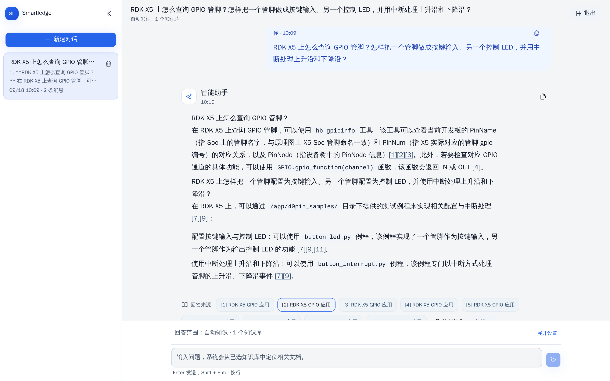
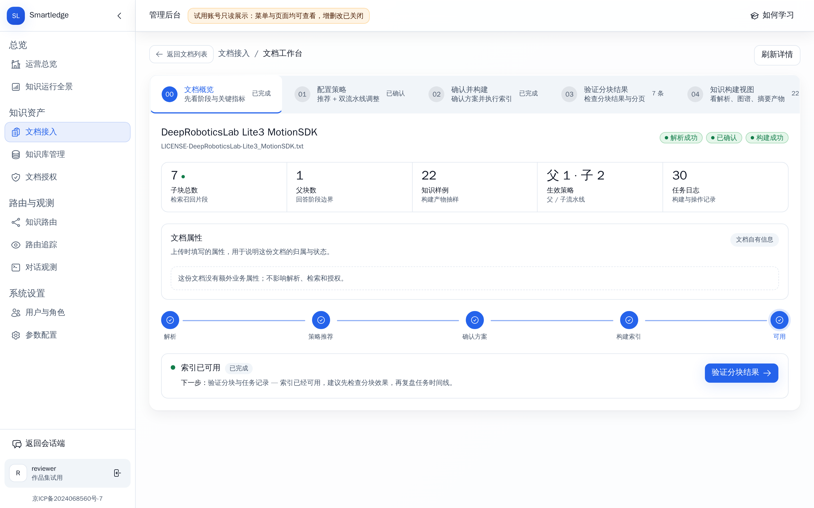
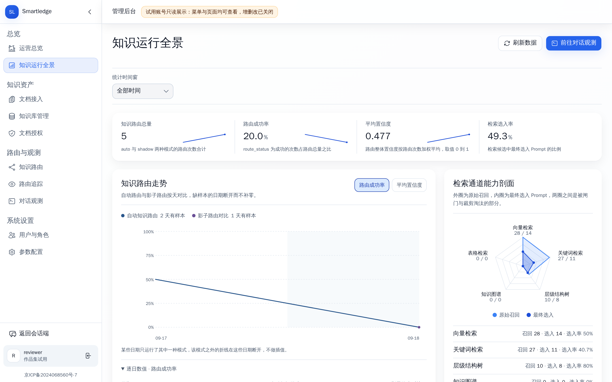
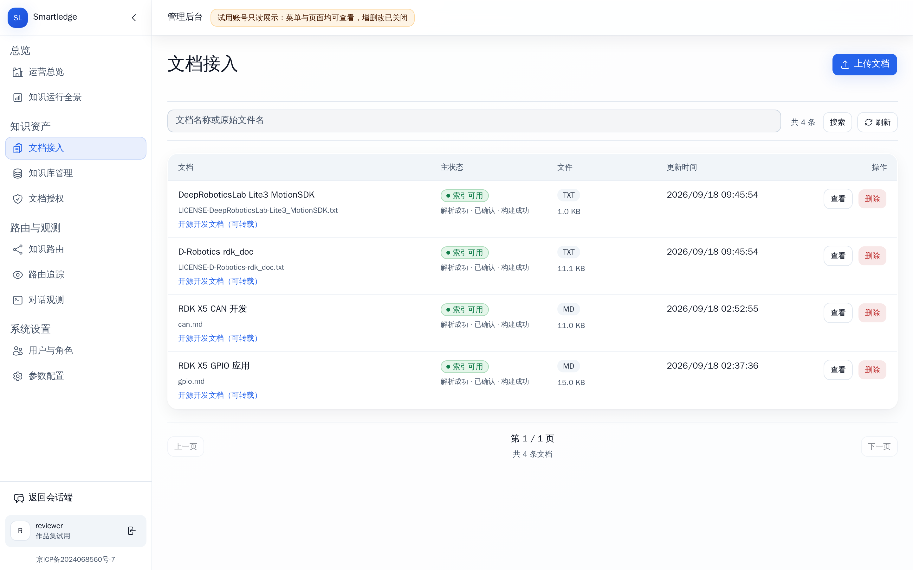
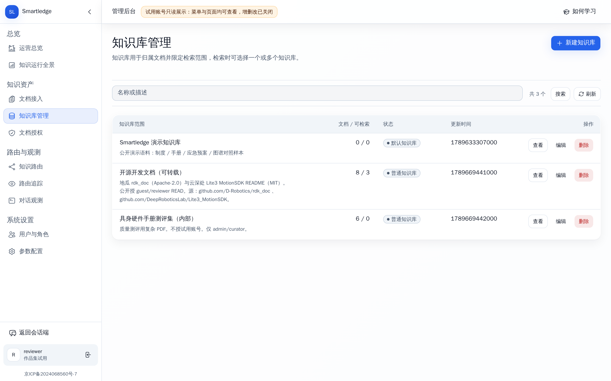
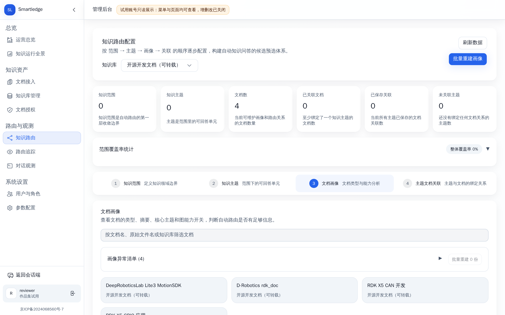
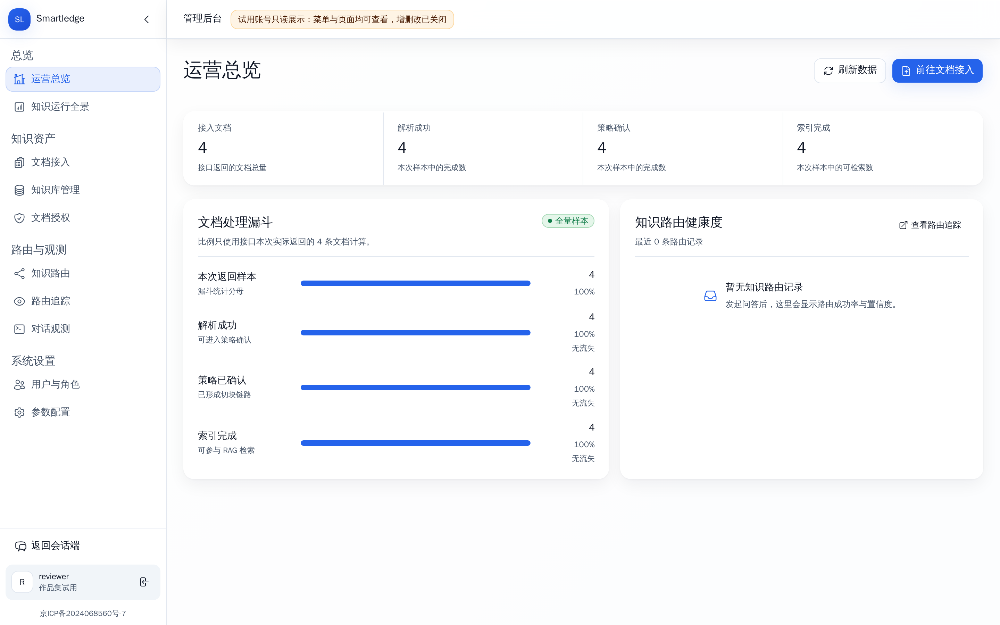

<p align="center">
  
</p>

<h1 align="center">Smartledge</h1>

<p align="center">
  <b>一份能核验来源的企业知识问答</b><br/>
  上传文档 → 划定范围 → 多路检索 → 带引用作答，把“问内部资料”做成可回放的主链路
</p>

<p align="center">
  
  
  
  
  
  
</p>

<p align="center">
  在线体验
  ·
  <a href="https://smartledge.cn/login">用户端</a>
  ·
  <a href="https://smartledge.cn/admin/login">管理端</a>
  <br/>
  登录页自带作品集试用账号（只读）
</p>

<p align="center">
  
</p>

---

**Smartledge 是一套多租户企业知识库问答。** 主线只有一件事：在用户选好的知识范围内检索真实文档，再给出能点开核对的答案。它不靠模型“看起来像引用”，回答里的 `[n]` 只能指向这一轮真正交给模型的来源。

Java 拥有整条业务主链路（范围、检索计划、通道、证据、引用、归档）；Python 只做解析、向量、重排、图谱与层次树这些算法活；Vue 是对话台和管理台。所有演示截图都来自当前前端对接线上实例的真实页面。

---

## 它怎么把文档变成答案

<table>
<tr>
<td width="33%" valign="top">

**① 划定范围**

先选知识库或指定文档，再检索。租户、权限和文档状态在检索前就生效，不会先搜全集再事后丢掉。

</td>
<td width="33%" valign="top">

**② 五路召回**

关键词、向量、表格、知识图谱、层次摘要各走独立通道，融合排序后选出最终证据。

</td>
<td width="33%" valign="top">

**③ 引用成答**

模型只根据已渲染的来源作答；界面展开的 `[1]` `[2]` 与这一轮来源清单一一对应。

</td>
</tr>
</table>

<p align="center">
  
  <em>文档工作台：这篇 GPIO 手册已切成 156 个可检索片段，父块与子块都能回看。</em>
</p>

**④ 看清这一轮怎么走的。** 管理台把知识路由、通道命中和运行全景摊开：这次问句走了哪几路、哪些进了 Prompt、哪些只是召回未入选，都可以顺着会话往下翻。

<p align="center">
  
</p>

---

## 架构

```
                 ┌────────────────────── 对话台 / 管理台 ──────────────────────┐
                 │  Vue 3 + Vite          问答 · 文档 · 知识库 · 路由 · 观测     │
                 └─────────────────────────────┬───────────────────────────────┘
                                               │  REST / SSE
┌──────────────────────────────────────────────▼──────────────────────────────────────────────┐
│                              Java 业务主链路（Spring Boot）                                 │
│                                                                                             │
│   知识范围 ──► RetrievalPlan ──► 五路通道 ──► 融合 / 重排 ──► 最终证据 ──► 引用绑定         │
│   库 / 文档 / ACL    只解释一次      关键词 · 向量                                         │
│                                      表格 · 图谱 · 层次树                                   │
│        │                                                                                    │
│        ▼                                                                                    │
│   文档任务与索引          会话 / 归档 / 观测              多租户认证与授权                   │
└──────────────────────────────────────────────┬──────────────────────────────────────────────┘
                                               │  协议投影（不改写范围与证据）
┌──────────────────────────────────────────────▼──────────────────────────────────────────────┐
│                              Python 算法工具箱（FastAPI）                                   │
│   文档解析 / OCR          向量 · 重排          GraphRAG 候选          RAPTOR 层次摘要       │
└──────────────────────────────────────────────┬──────────────────────────────────────────────┘
                                               │
                    MySQL · PostgreSQL/pgvector · Elasticsearch · Neo4j
                    Redis · RabbitMQ · MinIO
```

这条边界是刻意画的：谁能问哪些文档、最终留下哪些证据、答案能不能引用，只由 Java 决定一次。Python 可以换模型、换解析器，但不能改写范围或补一条“看起来相关”的引用。

---

## 能力地图

<table>
<tr>
<td width="50%"><br/><b>对话</b> — 流式作答、来源卡片、点开 `[n]` 核对原文</td>
<td width="50%"><br/><b>文档接入</b> — 上传、解析、建索引，看到每篇能不能被问</td>
</tr>
<tr>
<td width="50%"><br/><b>知识库</b> — 用库而不是单篇文件框定检索边界</td>
<td width="50%"><br/><b>知识路由</b> — 范围 → 主题 → 画像，自动收窄候选池</td>
</tr>
<tr>
<td width="50%"><br/><b>运营总览</b> — 接入、解析、策略、索引是否跑通</td>
<td width="50%"><br/><b>运行全景</b> — 各通道召回与入选，雷达图看能力剖面</td>
</tr>
</table>

---

## 技术栈

| | |
|---|---|
| **业务后端** | Java 17 · Spring Boot 3.5 · MyBatis-Plus · Redisson |
| **算法服务** | Python 3.11 · FastAPI · 解析 / 向量 / 重排 / 图谱 / 层次树 |
| **前端** | Vue 3 · Vite 6 · Tailwind · shadcn-vue |
| **存储** | MySQL · PostgreSQL + pgvector · Elasticsearch · Neo4j · Redis · RabbitMQ · MinIO |
| **模型** | 对话 / 向量 / 重排走 OpenAI 兼容网关（默认阿里云百炼）；解析可走 DocMind |

```
smartledge-business/          Java 业务主链路
  business-chat/              对话、文档、认证、管理接口
  rag-runtime/                检索计划、通道、融合、证据、引用
  knowledge-indexing/         解析、切块、索引编排
  knowledge-augmentation/     GraphRAG / RAPTOR
smartledge-rag-tools/         Python 算法工具箱
vue/                          对话台与管理台
deploy/                       依赖栈、启停与线上部署
sql/                          建表、迁移与种子
```

---

## 快速开始

```bash
cp .env.example .env          # 至少填入 ALI_BAI_LIAN_API_KEY
docker compose --env-file .env -f deploy/docker-compose.yml up -d

# Python 算法服务（默认云端向量/重排，不必下载本地大模型）
cd smartledge-rag-tools
uv venv --python 3.11 .venv
uv pip install --python .venv/bin/python -r requirements-cloud.txt
cd .. && deploy/start-rag-tools.sh --daemon

mvn -DskipTests package
java -jar smartledge-business/smartledge-business-chat/target/smartledge-business-chat-0.0.1-SNAPSHOT.jar

cd vue && npm install && npm run dev    # http://127.0.0.1:5174
```

本地种子账号：`admin` / `admin123456`（管理）、`alice` / `user123456`（对话）。线上试用走 [用户端](https://smartledge.cn/login) 的 guest、[管理端](https://smartledge.cn/admin/login) 的 reviewer。

更完整的单机部署步骤见 [deploy/server/README.md](deploy/server/README.md)。

---

## 许可

本项目以 **Apache License 2.0** 发布，见 [LICENSE](LICENSE)。

`smartledge-id-generator-framework` 适配自百度 uid-generator（Apache-2.0），模块内保留了原包结构与说明。
